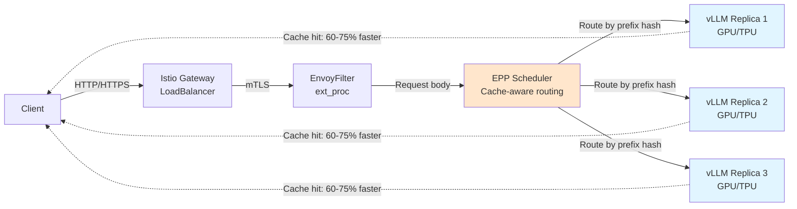

# RHAII Deployment on GKE

Deployment guides for **Red Hat AI Inference Services (RHAII)** vLLM workloads on Google Kubernetes Engine (GKE).

## Get Started

### Prerequisites and Setup
- [Prerequisites](docs/prerequisites.md) - Requirements before deploying
- [Environment Setup](docs/environment-setup.md) - Optional: Configure environment variables to streamline commands
- [Operator Installation](docs/operator-installation.md) - Install RHAII operators via [RHAII on XKS](https://github.com/opendatahub-io/rhaii-on-xks)

### Single Replica with Prefix Caching

Single-replica deployment demonstrating vLLM prefix caching effectiveness. Lower cost, simpler configuration.

- **[Simple Demo - TPU](deployments/istio-kserve/simple-caching-demo/deployment-tpu.md)** - 1 TPU node, ~8.3 req/s, ~$15/day
- **[Simple Demo - GPU](deployments/istio-kserve/simple-caching-demo/deployment-gpu.md)** - 1 GPU node, ~6 req/s, ~$12/day
- **[Pattern Overview](deployments/istio-kserve/simple-caching-demo/README.md)** - Architecture and technical details

### 3-Replica Deployment with Cache-Aware Routing

3-replica deployment with cache-aware routing for higher throughput. Requires EPP scheduler fix for cache routing.

- **[3-Replica - TPU](docs/deployment-tpu.md)** - 3 TPU nodes, ~25 req/s, ~$46/day
- **[3-Replica - GPU](docs/deployment-gpu.md)** - 3 GPU nodes, ~18 req/s, ~$36/day

---

## Architecture Overview



**Key Features:**
- Cache-aware routing - Identical prefixes route to same replica for cache hits
- 60-75% latency reduction - Cached prefix processing is dramatically faster
- mTLS encryption - Secure service-to-service communication
- Load balancing - Smart routing balances cache affinity and replica load

---

## 📖 Documentation

**Complete Index:** [Customer Guides Hub](docs/README.md)

### Operations
- [Verification & Testing](docs/verification-testing.md) - Validate your deployment
- [Troubleshooting](docs/troubleshooting.md) - Common issues and solutions

---

## 🛠️ Automation Scripts

All deployment guides use these automation scripts in `scripts/`:

### Validation Scripts
- `preflight-check.sh` - Comprehensive prerequisite validation
- `check-accelerator-availability.sh` - Zone and accelerator validation
- `check-nodepool-prerequisites.sh` - Node pool compatibility and quota checks

### Deployment Scripts
- `create-gke-cluster.sh` - Automated cluster creation with integrated validation
- `delete-gke-cluster.sh` - Safe cluster deletion or scale-to-zero
- `verify-deployment.sh` - Post-deployment health checks

**Example:**
```bash
# Run validation
./scripts/preflight-check.sh --customer --accelerator tpu

# Create cluster
./scripts/create-gke-cluster.sh --tpu

# Verify deployment
./scripts/verify-deployment.sh
```

---

## 📂 Repository Structure

```
rhaii-on-xks-gke/
├── README.md                              # This file
│
├── docs/                                  # Customer guides
│   ├── README.md                          # Guide index
│   ├── deployment-tpu.md                  # TPU deployment guide
│   ├── deployment-gpu.md                  # GPU deployment guide
│   ├── prerequisites.md                   # Setup requirements
│   ├── environment-setup.md               # Environment variable configuration
│   ├── operator-installation.md           # RHAII operator installation
│   ├── verification-testing.md            # Validation procedures
│   ├── prefix-caching-verification.md     # Prefix caching configuration verification
│   └── troubleshooting.md                 # Common issues
│
├── scripts/                               # Automation scripts
│   ├── create-gke-cluster.sh              # Cluster creation
│   ├── delete-gke-cluster.sh              # Cluster deletion / scale-to-zero
│   ├── verify-deployment.sh               # Post-deployment validation
│   ├── test-cache-routing.sh              # Cache routing and throughput test
│   ├── preflight-check.sh                 # Prerequisite validation
│   ├── check-accelerator-availability.sh  # Zone validation
│   └── check-nodepool-prerequisites.sh    # Node pool validation
│
├── deployments/                           # Kubernetes manifests
│   ├── gpu-operator/
│   │   └── resourcequota-gcp-critical-pods.yaml
│   └── istio-kserve/
│       ├── simple-caching-demo/           # Quick demo (single replica)
│       │   ├── README.md
│       │   ├── deployment-tpu.md
│       │   ├── deployment-gpu.md
│       │   ├── namespace-rhaii-inference.yaml
│       │   ├── llmisvc-tpu-single-replica.yaml
│       │   ├── llmisvc-gpu-single-replica.yaml
│       │   └── httproute-health-models.yaml
│       └── caching-pattern/               # 3-replica deployment
│           └── manifests/
│               ├── llmisvc-tpu-caching.yaml
│               ├── llmisvc-gpu-caching.yaml
│               ├── envoyfilter-epp-mtls-fix.yaml
│               ├── envoyfilter-epp-mtls-fix-tpu.yaml
│               ├── envoyfilter-ext-proc-gpu.yaml
│               ├── envoyfilter-ext-proc-tpu.yaml
│               ├── envoyfilter-route-extproc-body.yaml
│               ├── istio-cni.yaml
│               └── networkpolicies/
│                   ├── allow-gateway-to-vllm.yaml
│                   ├── allow-epp-scheduler.yaml
│                   ├── allow-istio.yaml
│                   └── allow-vllm-egress.yaml
│
├── templates/                             # Secret templates
│   ├── redhat-pull.yaml.template          # Red Hat registry credentials template
│   └── huggingface-token.yaml.template    # HuggingFace token template
│
└── env.sh.example                         # Environment variable example
```

---

## 🚀 Deployment Overview

### Step-by-Step Process

1. **Prerequisites** (15-30 minutes, one-time)
   - Install tools, configure accounts, request quotas

2. **Cluster Creation** (~20 minutes)
   ```bash
   ./scripts/create-gke-cluster.sh --tpu  # or --gpu
   ```

3. **Operator Installation** (~10 minutes)
   - Clone [RHAII on XKS](https://github.com/opendatahub-io/rhaii-on-xks) repository
   - Deploy operators (cert-manager, Istio, KServe, LWS)

4. **Deploy Workload** (~12 minutes)
   ```bash
   # Simple demo (single replica)
   kubectl apply -f deployments/istio-kserve/simple-caching-demo/llmisvc-tpu-single-replica.yaml

   # 3-replica deployment
   kubectl apply -f deployments/istio-kserve/caching-pattern/manifests/llmisvc-tpu-caching.yaml
   ```

5. **Verify & Test** (~5 minutes)
   ```bash
   ./scripts/verify-deployment.sh
   ./scripts/test-cache-routing.sh
   ```

**Total time:** ~45-50 minutes for complete deployment

---

## 🆘 Getting Help

1. Review [Troubleshooting](docs/troubleshooting.md) - Solutions to common issues
2. Run verification: `./scripts/verify-deployment.sh --operators-only`
3. Check logs: `kubectl logs -l serving.kserve.io/inferenceservice`

---

## 📝 License

This repository provides deployment configurations and documentation for Red Hat AI Inference Services (RHAII) on Google Cloud Platform.

**External Dependencies:**
- [RHAII on XKS](https://github.com/opendatahub-io/rhaii-on-xks) - Operator installation (required)
- Red Hat AI Inference Services - Commercial product (requires license)

---

## 🔗 Related Resources

- [RHAII on XKS GitHub](https://github.com/opendatahub-io/rhaii-on-xks) - Official operator repository
- [llm-d Documentation](https://llm-d.ai/docs/) - LLM framework architecture
- [GKE AI Labs](https://gke-ai-labs.dev) - Google Cloud AI resources
- [KServe Documentation](https://kserve.github.io/website/) - KServe reference
