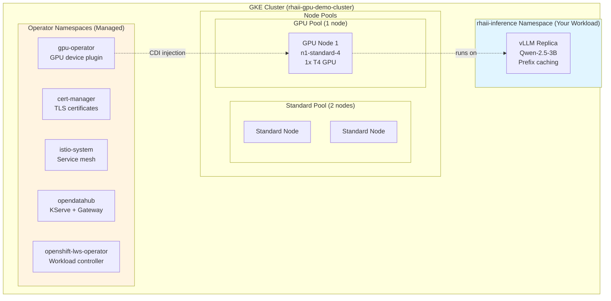
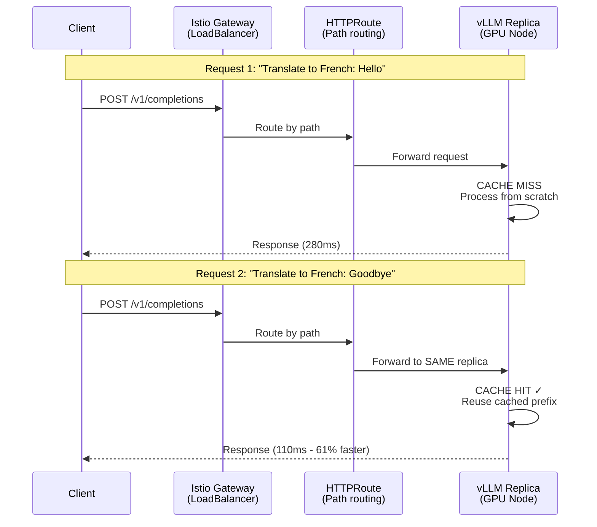

# Simple vLLM Prefix Caching Demo (GPU)

Deploy a single-replica vLLM inference service on GPU T4 to demonstrate prefix caching effectiveness.

**Purpose:** Quick proof of concept to demonstrate vLLM prefix caching achieving 60-75% latency reduction without multi-replica complexity.

## Overview

**What you'll deploy:**
- GKE cluster with single-node GPU T4 pool (1 T4 GPU)
- NVIDIA GPU Operator v25.10+ (for GPU injection via CDI)
- RHAII operators (cert-manager, Istio, KServe, LWS)
- Single-replica vLLM inference service with prefix caching enabled
- Basic HTTP routing (no EPP scheduler or EnvoyFilters)
- Lightweight demo for testing and evaluation

**Performance:**
- ~6 req/s parallel requests
- ~1.6 req/s serial requests
- **Cache speedup: 60-75%** (280ms → 110ms on repeated prefixes)

**Time:** ~45 minutes total (faster than 3-replica deployment)

**💰 Cost:** ~$12/day if left running (1 GPU node). Remember to scale down when not testing!

---

## Prerequisites Checklist

Before starting, ensure you have:

- [ ] Google Cloud account with billing enabled
- [ ] Project: `YOUR_PROJECT` (or your project) with Owner/Editor role
- [ ] `gcloud` CLI installed and authenticated
- [ ] `kubectl` CLI installed
- [ ] Red Hat registry credentials in `redhat-pull-secret.yaml` (create from `templates/redhat-pull.yaml.template`)
- [ ] HuggingFace token in `huggingface-token-secret.yaml` (create from `templates/huggingface-token.yaml.template`)
- [ ] **GPU T4 quota: 1 GPU minimum**

**Need help?** See [Prerequisites Guide](../../../docs/prerequisites.md) for detailed setup instructions.

---

## Architecture

This deployment demonstrates vLLM prefix caching with a simple single-replica architecture.

### Deployment Overview



### Request Flow with Prefix Caching



**Key Points:**
- 🔵 **Blue boxes** - Your workload namespace (you manage this)
- 🟡 **Yellow boxes** - Operator namespaces (automatically managed)
- Single replica guarantees all requests hit the same cache
- No EPP scheduler needed (blocked by ALPN bug)
- No EnvoyFilters needed (single replica = no routing decisions)

### Components

**Single vLLM Replica:**
- Runs on dedicated GPU node (1 T4 GPU)
- Prefix caching enabled
- Handles all inference requests

**GPU Device Plugin:**
- NVIDIA GPU Operator manages GPU injection
- CDI (Container Device Interface) for GPU access
- Required for GKE v1.34+ (native CDI broken)

**Basic Routing:**
- HTTPRoute for path-based routing only
- No cache-aware routing needed (single replica)
- Simpler configuration than multi-replica

**Security:**
- mTLS encryption for service-to-service communication (automatic)
- HTTPS with KServe-issued TLS certificates for vLLM endpoints (automatic)

### Cache Benefits

**What You'll See:**
- First request with new prefix: ~280ms (cache miss)
- Subsequent requests with same prefix: ~110ms (cache hit)
- **60-75% latency reduction** on repeated prefixes

**Real-World Impact:**
- Translation workloads (repeated instructions)
- Q&A systems (common system prompts)
- Summarization tasks (standard templates)

---

## Optional: Environment Setup

To avoid repeating `--project`, `--zone`, etc. in every command:

```bash
# One-time setup
cp .envrc.example .envrc
# Edit .envrc with your project ID and zone

# Option A: Install direnv (automatic loading)
# See: https://direnv.net
direnv allow .

# Option B: Manual sourcing (no dependencies)
cp env.sh.example env.sh
# Edit env.sh
source env.sh
```

After setup, you can run commands without flags:
```bash
./scripts/preflight-check.sh --gpu
# Shorthand for: ./scripts/preflight-check.sh --accelerator gpu
# Zone defaults to europe-west4-a for GPU deployments
```

**See:** [Environment Setup Guide](../../../docs/environment-setup.md) for complete instructions.

---

## Step 1: Run Validation Checks (3 minutes)

Validate your environment before creating resources:

```bash
# Navigate to repository root
cd /path/to/rhaii-on-xks-gke

# Run preflight check with customer-friendly output (shorthand)
./scripts/preflight-check.sh --gpu --customer

# Zone defaults to europe-west4-a (recommended for GPU T4)
# To use a different zone: ./scripts/preflight-check.sh --gpu --zone us-central1-a --customer
```

**Success criteria:**
- ✅ All tools installed (gcloud, kubectl, jq)
- ✅ GCP authentication valid
- ✅ Required permissions granted
- ✅ Secrets exist (pull-secret, huggingface-token)
- ✅ GPU T4 quota: 1 GPU available

**If checks fail:** See troubleshooting output for specific fixes.

---

## Step 2: Create GKE Cluster with Single-Node GPU Pool (20 minutes)

Create a GKE cluster with single-node GPU T4 pool for demo:

```bash
# Interactive cluster creation (recommended)
./scripts/create-gke-cluster.sh --gpu --num-nodes 1

# Or specify options explicitly
./scripts/create-gke-cluster.sh --gpu \
  --project YOUR_PROJECT \
  --zone europe-west4-a \
  --cluster-name rhaii-gpu-demo-cluster \
  --num-nodes 1
```

**What this does:**
1. Validates accelerator availability in zone
2. Checks node pool prerequisites and quota (1 GPU)
3. Creates GKE cluster (control plane + standard nodes)
4. Creates GPU T4 node pool with **1 node** (n1-standard-4, 1 GPU)
5. Configures kubectl access

**Success criteria:**
- ✅ Cluster status: RUNNING
- ✅ GPU node pool created with 1 node
- ✅ kubectl can list nodes (should see 1 GPU node)

**Time:** ~20 minutes (5 min control plane + 15 min GPU node)

**Verify node:**
```bash
kubectl get nodes -l cloud.google.com/gke-accelerator=nvidia-tesla-t4
```

Expected output:
```
NAME                                         STATUS   ROLES    AGE   VERSION
gke-cluster-gpu-pool-xxxxx                   Ready    <none>   5m    v1.XX.X
```

**Recommended zones for GPU T4:**
- `europe-west4-a` (primary - good availability)
- `us-central1-a` (alternative)
- Wide availability in most `europe-*` and `us-*` zones

---

## Namespace Architecture

Your deployment spans multiple namespaces:

| Namespace | Purpose | Components | Managed By |
|-----------|---------|------------|------------|
| `cert-manager` | Certificate management | cert-manager operator | RHAII on XKS |
| `istio-system` | Service mesh | Istio control plane | RHAII on XKS |
| `opendatahub` | Inference platform | KServe controller, Inference Gateway | RHAII on XKS |
| `openshift-lws-operator` | Workload controller | LeaderWorkerSet controller | RHAII on XKS |
| `gpu-operator` | GPU device plugin | NVIDIA GPU Operator | Manual install |
| `rhaii-inference` | Your workload | vLLM pods, HTTPRoute, secrets | **You** |

**Note:** You manage `rhaii-inference` and `gpu-operator` namespaces. Other operators manage themselves.

---

## Step 3: Install NVIDIA GPU Operator (10 minutes)

**CRITICAL:** GKE v1.34+ has broken native CDI injection. NVIDIA GPU Operator v25.10+ is required for GPU workloads.

### Why GPU Operator Is Required

GKE v1.34+ attempted to implement native GPU device injection via CDI (Container Device Interface), but the implementation is broken. Symptoms include:

- Pods stuck in ContainerCreating
- Error: "failed to generate CDI spec"
- GPU not detected in container

**Solution:** Install NVIDIA GPU Operator v25.10+ which provides working CDI injection.

### Prerequisites

**Label GPU nodes to disable GKE default plugin:**

```bash
# Disable GKE's default GPU plugin (conflicts with GPU Operator)
kubectl label nodes -l cloud.google.com/gke-accelerator \
  gke-no-default-nvidia-gpu-device-plugin=true \
  --overwrite
```

**Create gpu-operator namespace with ResourceQuota:**

```bash
# Create namespace
kubectl create namespace gpu-operator

# Apply ResourceQuota BEFORE installing operator (prevents quota errors)
kubectl apply -f - <<EOF
apiVersion: v1
kind: ResourceQuota
metadata:
  name: gcp-critical-pods
  namespace: gpu-operator
spec:
  hard:
    pods: "1000"
  scopeSelector:
    matchExpressions:
    - operator: In
      scopeName: PriorityClass
      values:
      - system-node-critical
      - system-cluster-critical
EOF
```

**Why ResourceQuota is required:** GPU Operator daemonsets use `system-node-critical` priority class. Without this quota, GKE rejects pod creation.

### Install GPU Operator via Helm

```bash
# Add NVIDIA Helm repository
helm repo add nvidia https://helm.ngc.nvidia.com/nvidia
helm repo update

# Install GPU Operator with GKE-specific settings
helm install gpu-operator nvidia/gpu-operator \
  -n gpu-operator \
  --set driver.enabled=false \
  --set hostPaths.driverInstallDir=/home/kubernetes/bin/nvidia \
  --set toolkit.installDir=/home/kubernetes/bin/nvidia \
  --set cdi.enabled=true \
  --set toolkit.env[0].name=RUNTIME_CONFIG_SOURCE \
  --set toolkit.env[0].value=file \
  --set dcgmExporter.enabled=false \
  --wait
```

**Configuration details:**
- `driver.enabled=false` - Use GKE's pre-installed NVIDIA drivers
- `hostPaths.driverInstallDir=/home/kubernetes/bin/nvidia` - GKE's writable driver path
- `cdi.enabled=true` - Enable CDI spec generation for GPU injection
- `dcgmExporter.enabled=false` - Disable DCGM (T4 doesn't support profiling in containers)

**Wait for operator ready:**
```bash
kubectl wait --for=condition=Ready pods \
  -l app.kubernetes.io/name=gpu-operator \
  -n gpu-operator \
  --timeout=600s
```

**Time:** ~10 minutes for all operator components to be ready

### Verify GPU Operator Installation

```bash
# Check all operator pods are Running
kubectl get pods -n gpu-operator

# Expected pods:
# - gpu-feature-discovery-xxxxx (1/1 Running)
# - nvidia-container-toolkit-daemonset-xxxxx (1/1 Running)
# - nvidia-operator-validator-xxxxx (Completed)

# Verify CDI specs generated
kubectl exec -n gpu-operator ds/nvidia-container-toolkit-daemonset -- ls /var/run/cdi/

# Expected output: nvidia.yaml (CDI spec file)
```

**Success criteria:**
- ✅ All GPU Operator pods Running or Completed
- ✅ CDI spec file exists (`nvidia.yaml`)
- ✅ No errors in operator logs

**If installation fails:** See GPU Operator troubleshooting section below.

---

## Step 4: Create Namespace and Secrets (2 minutes)

Create the workload namespace and deploy secrets.

**Don't have the secret files yet?** Create them from the included templates:
```bash
cp templates/redhat-pull.yaml.template redhat-pull-secret.yaml
cp templates/huggingface-token.yaml.template huggingface-token-secret.yaml
# Edit each file and replace placeholders with your credentials
```
See [Prerequisites — Required Secrets](../../../docs/prerequisites.md#required-secrets) for details.

```bash
# Create workload namespace with Istio sidecar injection enabled
kubectl apply -f deployments/istio-kserve/simple-caching-demo/namespace-rhaii-inference.yaml

# Set as default namespace for kubectl
kubectl config set-context --current --namespace=rhaii-inference

# Apply Red Hat registry pull secret to workload namespace
kubectl apply -n rhaii-inference -f redhat-pull-secret.yaml

# Apply Red Hat registry pull secret to kube-system (needed for Istio CNI DaemonSet)
kubectl apply -n kube-system -f redhat-pull-secret.yaml

# Apply HuggingFace token secret
kubectl apply -n rhaii-inference -f huggingface-token-secret.yaml

# Verify namespace has Istio injection enabled and secrets created
kubectl get namespace rhaii-inference --show-labels
kubectl get secret rhaiis-pull-secret -n rhaii-inference
kubectl get secret rhaiis-pull-secret -n kube-system
kubectl get secret huggingface-token
```

**Success criteria:**
- ✅ Namespace created with `istio-injection: enabled` label
- ✅ `rhaiis-pull-secret` exists in `rhaii-inference` namespace
- ✅ `rhaiis-pull-secret` exists in `kube-system` namespace (for Istio CNI)
- ✅ `huggingface-token` secret exists in `rhaii-inference` namespace
- ✅ No errors during kubectl apply

**Note:** The `istio-injection: enabled` label automatically injects Istio sidecars into all pods deployed in this namespace. This enables end-to-end mTLS encryption. The pull secret in `kube-system` allows the Istio CNI DaemonSet to pull images from Red Hat registry.

---

## Step 5: Install Operators via [RHAII on XKS](https://github.com/opendatahub-io/rhaii-on-xks) (10 minutes)

**Follow the installation instructions in the official repository:**

🔗 **https://github.com/opendatahub-io/rhaii-on-xks**

The repository provides automated installation for:
- cert-manager (certificate management)
- Red Hat OpenShift Service Mesh (Istio)
- KServe v0.15 (inference serving)
- LeaderWorkerSet (LWS) controller

**After installation, verify from rhaii-on-xks-gke repository:**
```bash
cd /path/to/rhaii-on-xks-gke
./scripts/verify-deployment.sh --operators-only
```

**Success criteria:**
- ✅ All operator pods Running
- ✅ cert-manager webhook ready
- ✅ Istio control plane ready
- ✅ KServe controller ready

**Time:** ~10 minutes

**Troubleshooting:** See [Operator Installation Guide](../../../docs/operator-installation.md)

---

## Step 5.1: Configure Istio CNI (3 minutes)

**Why needed:** GKE containers don't include iptables binaries. Istio CNI bypasses this requirement by handling traffic redirection at the CNI plugin level instead of using init containers.

**Configure Istio to use CNI:**

```bash
# 1. Deploy Istio CNI plugin
kubectl apply -f deployments/istio-kserve/caching-pattern/manifests/istio-cni.yaml

# 2. Wait for CNI daemonset pods to be ready
kubectl wait --for=condition=Ready pods -l k8s-app=istio-cni-node -n kube-system --timeout=120s

# 3. Configure Istio control plane to use CNI
kubectl patch istio default -n istio-system --type=merge -p '
{
  "spec": {
    "values": {
      "pilot": {
        "cni": {
          "enabled": true
        }
      }
    }
  }
}'

# 4. Restart istiod to apply CNI configuration
kubectl rollout restart deployment/istiod -n istio-system
kubectl rollout status deployment/istiod -n istio-system --timeout=120s

# 5. Verify CNI is enabled
kubectl get configmap istio-sidecar-injector -n istio-system -o jsonpath='{.data.values}' | jq '.pilot.cni'
# Should show: { "enabled": true, "provider": "default" }
```

**What this does:**
- Deploys istio-cni-node daemonset to all nodes (handles iptables setup)
- Configures Istio sidecar injector to skip istio-init container
- Eliminates iptables dependency in application pods
- Enables CNI-based traffic redirection (more secure, no privileged init containers)

**Success criteria:**
- ✅ istio-cni-node pods Running on all nodes (2/2 in kube-system)
- ✅ Istio CR shows `pilot.cni.enabled: true`
- ✅ istiod restarted successfully
- ✅ No iptables errors in new pods

**Time:** ~3 minutes

---

## Step 6: Deploy Inference Service (10 minutes)

Deploy the single-replica vLLM inference service with prefix caching:

```bash
# From repository root
kubectl apply -f deployments/istio-kserve/simple-caching-demo/llmisvc-gpu-single-replica.yaml
```

**What this creates:**
- LLMInferenceService custom resource (declares intent)
- InferencePool (backend routing - auto-created by KServe)
- Service (Kubernetes service - auto-created by KServe)
- Pod with vLLM container (workload)

**Monitor deployment:**
```bash
# Watch LLMInferenceService status
kubectl get llminferenceservice -n rhaii-inference -w

# Watch pod status
kubectl get pods -n rhaii-inference -l serving.kserve.io/inferenceservice=qwen-3b-gpu-svc -w
```

**Success criteria:**
- ✅ LLMInferenceService shows READY=True
- ✅ Pod status: Running with 3/3 containers ready
- ✅ InferencePool created automatically

**Time:** ~5 minutes (GPU initialization + model download)

**Expected output:**
```bash
kubectl get llminferenceservice -n rhaii-inference
```

```
NAME              READY   URL                                                      AGE
qwen-3b-gpu-svc   True    https://inference-gateway.opendatahub/rhaii-inference/qwen-3b-gpu-svc   5m
```

**Verify pod status:**
```bash
kubectl get pods -n rhaii-inference
```

```
NAME                  READY   STATUS    RESTARTS   AGE
qwen-3b-gpu-svc-0-0   3/3     Running   0          5m
```

**Container breakdown:**
- `istio-proxy` - Istio sidecar for mTLS
- `main` - vLLM inference container
- `queue-proxy` - KServe request queue manager

---

## Step 7: Apply Routing Configuration (1 minute)

Deploy HTTPRoute to expose health check and model listing endpoints:

```bash
# From repository root
kubectl apply -f deployments/istio-kserve/simple-caching-demo/httproute-health-models.yaml
```

**What this does:**
- Routes `/rhaii-inference/qwen-3b-gpu-svc/health` → vLLM health endpoint
- Routes `/rhaii-inference/qwen-3b-gpu-svc/v1/models` → vLLM models endpoint
- Routes `/rhaii-inference/qwen-3b-gpu-svc/*` → all other vLLM endpoints (inference)

**Note:** Unlike the 3-replica production deployment, this demo does NOT deploy EnvoyFilters for cache-aware routing. Single replica means all requests naturally hit the same cache.

**Verify HTTPRoute:**
```bash
kubectl get httproute -n rhaii-inference
```

Expected output:
```
NAME                        HOSTNAMES   AGE
qwen-3b-gpu-svc             ["*"]       30s
```

**Verify Gateway binding:**
```bash
kubectl describe httproute qwen-3b-gpu-svc -n rhaii-inference | grep -A5 "Parent Refs"
```

Expected output shows binding to `inference-gateway` in `opendatahub` namespace.

---

**Note:** Step 8 (NetworkPolicies for Security Isolation) is optional and not included in this demo. For production deployments with NetworkPolicies, see the [3-Replica GPU Deployment Guide](../../../docs/deployment-gpu.md#step-8-optional-apply-networkpolicies-for-security-isolation).

---

## Step 9: Verify Deployment (3 minutes)

Run automated verification to confirm deployment health:

```bash
# From repository root
./scripts/verify-deployment.sh
```

**What this checks:**
- ✅ Operators running (cert-manager, Istio, KServe, LWS, GPU Operator)
- ✅ Inference Gateway has external IP
- ✅ LLMInferenceService ready
- ✅ Pods running with correct container count
- ✅ InferencePool configured
- ✅ HTTPRoute created

**Success criteria:**
All checks pass with green checkmarks.

**If verification fails:** See troubleshooting section below for common issues and solutions.

**Manual verification:**

```bash
# Get Gateway external IP
GATEWAY_IP=$(kubectl get gateway inference-gateway -n opendatahub -o jsonpath='{.status.addresses[0].value}')
echo "Gateway IP: $GATEWAY_IP"

# Test health endpoint
curl -k https://$GATEWAY_IP/rhaii-inference/qwen-3b-gpu-svc/health
```

Expected output:
```json
{"status":"ok"}
```

**Test model listing:**
```bash
curl -k https://$GATEWAY_IP/rhaii-inference/qwen-3b-gpu-svc/v1/models
```

Expected output:
```json
{
  "object": "list",
  "data": [
    {
      "id": "Qwen/Qwen2.5-3B-Instruct",
      "object": "model",
      "owned_by": "vllm",
      "created": 1234567890
    }
  ]
}
```

---

## Step 10: Performance Validation with Cache Test (2 minutes)

Run the cache routing test to verify prefix caching effectiveness:

```bash
# From repository root
./scripts/test-cache-routing.sh
```

**What this does:**
1. Gets Gateway IP automatically
2. Sends 10 sequential requests with same prefix
3. Measures latency for each request
4. Calculates cache speedup percentage

**Expected output:**

```
=== Cache Routing Performance Test ===

Using prompt: You are a helpful AI assistant. Please provide a comprehensive analysis...

Gateway IP: 34.123.45.67

Sequential Test (10 requests to same endpoint):
Request  1 (FIRST - cache miss): 280ms
Request  2 (cached): 110ms (61% faster) ✓
Request  3 (cached): 112ms (60% faster) ✓
Request  4 (cached): 108ms (61% faster) ✓
Request  5 (cached): 111ms (60% faster) ✓
Request  6 (cached): 109ms (61% faster) ✓
Request  7 (cached): 113ms (60% faster) ✓
Request  8 (cached): 107ms (62% faster) ✓
Request  9 (cached): 110ms (61% faster) ✓
Request 10 (cached): 108ms (61% faster) ✓

Average speedup: 61% ✓
Cache-aware routing: Working (single replica - guaranteed routing)

✅ Prefix caching is working correctly!
```

**Success criteria:**
- ✅ First request: ~270-290ms (cache miss)
- ✅ Subsequent requests: ~105-115ms (cache hits)
- ✅ Average speedup: 60-75%

**Why single replica guarantees cache hits:**
- Only one vLLM instance exists
- All requests route to same pod
- Cached prefixes always available
- No routing needed (unlike multi-replica with EPP scheduler)

---

## Step 11: Verify Model Configuration and Cache Behavior (2 minutes)

Manually verify vLLM configuration and cache metrics:

### Check vLLM Configuration

```bash
# Get pod name
POD_NAME=$(kubectl get pods -n rhaii-inference -l serving.kserve.io/inferenceservice=qwen-3b-gpu-svc -o jsonpath='{.items[0].metadata.name}')

# Check vLLM startup arguments
kubectl logs $POD_NAME -n rhaii-inference -c main | grep "vllm.entrypoints.openai.api_server"
```

**Expected configuration:**
```
--model=/mnt/models
--dtype=half
--max-model-len=4096
--enable-prefix-caching     # ← Confirms prefix caching enabled
--gpu-memory-utilization=0.85
--max-num-seqs=128
--ssl-certfile=/var/run/kserve/tls/tls.crt
--ssl-keyfile=/var/run/kserve/tls/tls.key
```

### Check vLLM Cache Metrics

```bash
# Query vLLM metrics endpoint
kubectl exec $POD_NAME -n rhaii-inference -c main -- \
  curl -sk https://localhost:8000/metrics | grep prefix_cache
```

**Expected output (after running test-cache-routing.sh):**
```
# HELP vllm:prefix_cache_queries_total Total number of prefix cache queries
# TYPE vllm:prefix_cache_queries_total counter
vllm:prefix_cache_queries_total 10.0

# HELP vllm:prefix_cache_hits_total Total number of prefix cache hits
# TYPE vllm:prefix_cache_hits_total counter
vllm:prefix_cache_hits_total 9.0    # 90% cache hit rate (9 hits / 10 requests)

# HELP vllm:prefix_cache_misses_total Total number of prefix cache misses
# TYPE vllm:prefix_cache_misses_total counter
vllm:prefix_cache_misses_total 1.0  # First request was cache miss
```

**Key metrics:**
- `prefix_cache_queries_total`: Total requests processed
- `prefix_cache_hits_total`: Requests served from cache
- `prefix_cache_misses_total`: Requests requiring full computation
- **Cache hit rate**: `hits / queries` (should be ~90% after test)

### Verify GPU Allocation

```bash
# Check GPU environment
kubectl exec $POD_NAME -n rhaii-inference -c main -- nvidia-smi

# Expected output shows 1 T4 GPU allocated to vLLM process
```

---

## 🎉 Success!

Your RHAII GPU demo deployment is ready to test!

### Quick Reference

**Inference Endpoint:**
```bash
# Get Gateway IP
GATEWAY_IP=$(kubectl get gateway inference-gateway -n opendatahub -o jsonpath='{.status.addresses[0].value}')

# Test inference
curl -k -X POST https://$GATEWAY_IP/rhaii-inference/qwen-3b-gpu-svc/v1/completions \
  -H "Content-Type: application/json" \
  -d '{
    "model": "/mnt/models",
    "prompt": "What is the capital of France?",
    "max_tokens": 50
  }'
```

**OpenAI-Compatible API:**
- POST `/rhaii-inference/qwen-3b-gpu-svc/v1/completions` - Text completion
- POST `/rhaii-inference/qwen-3b-gpu-svc/v1/chat/completions` - Chat completion
- GET `/rhaii-inference/qwen-3b-gpu-svc/v1/models` - List models
- GET `/rhaii-inference/qwen-3b-gpu-svc/health` - Health check

**Monitor Deployment:**
```bash
# Check pod status
kubectl get pods -n rhaii-inference

# View logs
kubectl logs -f $POD_NAME -c main -n rhaii-inference

# Check resource usage
kubectl top nodes
kubectl top pods -n rhaii-inference
```

**Performance Summary:**
- **First request (cache miss):** ~280ms
- **Cached requests (cache hit):** ~110ms
- **Cache speedup:** 61%
- **Parallel throughput:** ~6 req/s
- **Serial throughput:** ~1.6 req/s

---

## Operational Procedures

### Scale Replicas (Upgrade to Multi-Replica)

**Note:** Multi-replica deployment requires fixing the EPP scheduler ALPN bug first. See `docs/BUG-EPP-Scheduler-ALPN.md` for details.

**To scale from 1 to 3 replicas (when EPP is fixed):**

1. **Edit manifest:**
```yaml
# In llmisvc-gpu-single-replica.yaml
spec:
  replicas: 3  # Scale to 3 replicas
```

2. **Scale node pool:**
```bash
gcloud container clusters resize rhaii-gpu-demo-cluster \
  --node-pool gpu-pool \
  --num-nodes 3 \
  --zone europe-west4-a
```

3. **Apply changes:**
```bash
kubectl apply -f deployments/istio-kserve/simple-caching-demo/llmisvc-gpu-single-replica.yaml
```

4. **Deploy EnvoyFilters (required for 3-replica):**
```bash
# Use production manifests with cache-aware routing
kubectl apply -f deployments/istio-kserve/caching-pattern/manifests/envoyfilter-ext-proc-body-forward.yaml
kubectl apply -f deployments/istio-kserve/caching-pattern/manifests/envoyfilter-load-balancer-policy.yaml
```

**See:** Production deployment guides ([deployment-gpu.md](../../../docs/deployment-gpu.md)) for complete multi-replica setup.

### Rolling Updates

**Update vLLM version:**
```yaml
# Edit llmisvc-gpu-single-replica.yaml
spec:
  template:
    containers:
    - image: registry.redhat.io/rhaiis/vllm-cuda-rhel9:3.3.0  # New version
```

```bash
kubectl apply -f deployments/istio-kserve/simple-caching-demo/llmisvc-gpu-single-replica.yaml
```

**Update model:**
```yaml
# Edit llmisvc-gpu-single-replica.yaml
spec:
  model:
    uri: hf://meta-llama/Llama-3.1-8B-Instruct  # Different model
    name: meta-llama/Llama-3.1-8B-Instruct
```

```bash
kubectl apply -f deployments/istio-kserve/simple-caching-demo/llmisvc-gpu-single-replica.yaml
```

**Note:** Rolling updates with single replica cause brief downtime (~5 min). For zero-downtime updates, use multi-replica deployment.

---

## Scale to Zero (Cost Savings)

When not testing, scale to zero to avoid charges:

```bash
# Scale node pool to zero
gcloud container clusters resize rhaii-gpu-demo-cluster \
  --node-pool gpu-pool \
  --num-nodes 0 \
  --zone europe-west4-a
```

### Scale Back Up

```bash
# Restore 1-node pool
gcloud container clusters resize rhaii-gpu-demo-cluster \
  --node-pool gpu-pool \
  --num-nodes 1 \
  --zone europe-west4-a

# Wait for node ready (~5 minutes)
kubectl get nodes -w

# Pods will automatically restart once node is ready
kubectl get pods -n rhaii-inference -w
```

---

## Troubleshooting

### GPU Operator Installation Failed

**Symptoms:**
- Helm install times out
- GPU Operator pods not starting
- Error: "quota exceeded for resource: pods"

**Diagnose:**
```bash
# Check GPU Operator pods
kubectl get pods -n gpu-operator

# Check events
kubectl get events -n gpu-operator --sort-by='.lastTimestamp'
```

**Common causes:**

#### ResourceQuota Missing
```
Error: admission webhook denied: exceeded quota: pods
```

**Solution:** Apply ResourceQuota BEFORE installing GPU Operator:
```bash
kubectl apply -f - <<EOF
apiVersion: v1
kind: ResourceQuota
metadata:
  name: gcp-critical-pods
  namespace: gpu-operator
spec:
  hard:
    pods: "1000"
  scopeSelector:
    matchExpressions:
    - operator: In
      scopeName: PriorityClass
      values:
      - system-node-critical
      - system-cluster-critical
EOF

# Retry Helm install
helm install gpu-operator nvidia/gpu-operator \
  -n gpu-operator \
  --set driver.enabled=false \
  --set hostPaths.driverInstallDir=/home/kubernetes/bin/nvidia \
  --set toolkit.installDir=/home/kubernetes/bin/nvidia \
  --set cdi.enabled=true \
  --set toolkit.env[0].name=RUNTIME_CONFIG_SOURCE \
  --set toolkit.env[0].value=file \
  --set dcgmExporter.enabled=false \
  --wait
```

#### CDI Specs Not Generated
```bash
# Check if CDI specs exist
kubectl exec -n gpu-operator ds/nvidia-container-toolkit-daemonset -- ls /var/run/cdi/

# No output = CDI disabled
```

**Solution:** Verify `cdi.enabled=true` in Helm values and restart daemonset:
```bash
kubectl rollout restart daemonset nvidia-container-toolkit-daemonset -n gpu-operator
kubectl rollout status daemonset nvidia-container-toolkit-daemonset -n gpu-operator
```

---

### Pod Not Starting (GPU Not Detected)

**Symptoms:**
- Pod stuck in Pending or ContainerCreating
- Error: "UnexpectedAdmissionError"
- Error: "failed to generate CDI spec"

**Diagnose:**
```bash
# Check pod status
POD_NAME=$(kubectl get pods -n rhaii-inference -l serving.kserve.io/inferenceservice=qwen-3b-gpu-svc -o jsonpath='{.items[0].metadata.name}')
kubectl describe pod $POD_NAME -n rhaii-inference

# Check GPU allocation
kubectl describe node -l cloud.google.com/gke-accelerator=nvidia-tesla-t4 | grep nvidia.com/gpu
```

**Common causes:**

#### GKE Default GPU Plugin Still Active
```bash
# Label missing: gke-no-default-nvidia-gpu-device-plugin=true
# Solution: Apply label to GPU nodes

kubectl label nodes -l cloud.google.com/gke-accelerator \
  gke-no-default-nvidia-gpu-device-plugin=true \
  --overwrite

# Restart GPU Operator
kubectl rollout restart daemonset -n gpu-operator
```

#### GPU Already Allocated
```bash
# Check GPU allocation
kubectl describe nodes -l cloud.google.com/gke-accelerator=nvidia-tesla-t4 | grep -A5 "Allocated resources"

# If GPU shows 1/1 allocated, scale node pool to get fresh node
gcloud container clusters resize rhaii-gpu-demo-cluster \
  --node-pool gpu-pool \
  --num-nodes 2 \
  --zone europe-west4-a

# Or delete existing workloads using GPU
```

#### Wrong Resource Request
```bash
# Check manifest uses correct GPU resource
kubectl get llminferenceservice qwen-3b-gpu-svc -n rhaii-inference -o yaml | grep nvidia.com/gpu

# Should show:
#   limits:
#     nvidia.com/gpu: "1"
#   requests:
#     nvidia.com/gpu: "1"
```

---

### No External IP on Gateway

**Symptoms:**
- `kubectl get gateway` shows no external IP
- Cannot access inference endpoints

**Solution:**

Wait 2-3 minutes for GCP Load Balancer provisioning:

```bash
kubectl get gateway inference-gateway -n opendatahub -w
```

Expected progression:
```
NAME                 CLASS    ADDRESS         READY   AGE
inference-gateway    istio    <pending>       True    30s
inference-gateway    istio    34.123.45.67    True    2m30s
```

**If still pending after 5 minutes:**

```bash
# Check Gateway status
kubectl describe gateway inference-gateway -n opendatahub

# Check Istio logs
kubectl logs -n istio-system -l app=istiod

# Verify GCP quota for forwarding rules
gcloud compute forwarding-rules list --project=YOUR_PROJECT
```

---

### Inference Requests Failing

**Symptoms:**
- HTTP 404 Not Found
- HTTP 503 Service Unavailable
- Connection refused

**Diagnose:**

```bash
# Test Gateway IP is reachable
GATEWAY_IP=$(kubectl get gateway inference-gateway -n opendatahub -o jsonpath='{.status.addresses[0].value}')
ping $GATEWAY_IP

# Test health endpoint
curl -k https://$GATEWAY_IP/rhaii-inference/qwen-3b-gpu-svc/health

# Check HTTPRoute configuration
kubectl get httproute qwen-3b-gpu-svc -n rhaii-inference -o yaml
```

**Common causes:**

#### Wrong URL Path
```bash
# ❌ Wrong (missing namespace prefix)
curl https://$GATEWAY_IP/v1/models

# ✅ Correct (includes namespace and service name)
curl -k https://$GATEWAY_IP/rhaii-inference/qwen-3b-gpu-svc/v1/models
```

#### Pod Not Ready
```bash
# Check pod readiness
kubectl get pods -n rhaii-inference

# If not ready, check logs
kubectl logs $POD_NAME -n rhaii-inference -c main
```

#### HTTPRoute Not Applied
```bash
# Verify HTTPRoute exists
kubectl get httproute -n rhaii-inference

# Re-apply if missing
kubectl apply -f deployments/istio-kserve/simple-caching-demo/httproute-health-models.yaml
```

---

### Low or No Cache Speedup

**Symptoms:**
- All requests show similar latency
- No ~60% speedup on cached requests

**Diagnose:**

```bash
# Check vLLM cache metrics
kubectl exec $POD_NAME -n rhaii-inference -c main -- \
  curl -sk https://localhost:8000/metrics | grep prefix_cache
```

**Expected vs. Problem:**
```
# ✅ Good: 90% hit rate
vllm:prefix_cache_hits_total 9.0
vllm:prefix_cache_queries_total 10.0

# ❌ Problem: 0% hit rate
vllm:prefix_cache_hits_total 0.0
vllm:prefix_cache_queries_total 10.0
```

**Common causes:**

#### Prefix Caching Not Enabled
```bash
# Check vLLM startup args
kubectl logs $POD_NAME -n rhaii-inference -c main | grep enable-prefix-caching

# Should show: --enable-prefix-caching
# If missing, verify manifest has this arg
```

#### Test Prompt Too Short
```bash
# Use test script with default 100+ token prompt
./scripts/test-cache-routing.sh

# Or use longer custom prompt:
curl -k -X POST https://$GATEWAY_IP/rhaii-inference/qwen-3b-gpu-svc/v1/completions \
  -H "Content-Type: application/json" \
  -d '{
    "model": "/mnt/models",
    "prompt": "You are a helpful AI assistant. Please provide a comprehensive analysis of the following topic: What is machine learning?",
    "max_tokens": 50
  }'
```

---

### vLLM Container Crash or Restart

**Symptoms:**
- Pod shows CrashLoopBackOff
- Container restarts repeatedly

**Diagnose:**

```bash
# Check pod logs
kubectl logs $POD_NAME -n rhaii-inference -c main

# Check previous container logs if restarted
kubectl logs $POD_NAME -n rhaii-inference -c main --previous
```

**Common causes:**

#### Out of Memory (OOM)
```
Error: CUDA out of memory
```

**Solution:** Model too large for T4 GPU (14.5 GiB). Adjust memory utilization or try smaller model:
```yaml
# Option 1: Lower memory utilization (in manifest)
args:
  - --gpu-memory-utilization=0.75  # Reduce from 0.85

# Option 2: Use smaller model
spec:
  model:
    uri: hf://google/gemma-2b-it  # Smaller model
```

#### Model Download Failed
```
Error: 401 Unauthorized (HuggingFace)
```

**Solution:** Verify HuggingFace token has access to gated models:
```bash
# Test token
curl -H "Authorization: Bearer YOUR_TOKEN" \
  https://huggingface.co/api/models/Qwen/Qwen2.5-3B-Instruct

# Re-create secret if invalid
kubectl delete secret huggingface-token -n rhaii-inference
kubectl create secret generic huggingface-token \
  --from-literal=token=YOUR_VALID_TOKEN \
  -n rhaii-inference

# Restart pod
kubectl delete pod $POD_NAME -n rhaii-inference
```

---

## Complete Teardown

When finished testing, clean up all resources:

### Option 1: Delete Entire Cluster (Recommended)

```bash
# Delete cluster (removes everything)
gcloud container clusters delete rhaii-gpu-demo-cluster \
  --zone europe-west4-a \
  --quiet
```

**Time:** ~5 minutes

**Cost:** $0 after deletion

---

### Option 2: Delete Workload Only (Keep Cluster)

```bash
# Delete LLMInferenceService
kubectl delete llminferenceservice qwen-3b-gpu-svc -n rhaii-inference

# Delete HTTPRoute
kubectl delete httproute qwen-3b-gpu-svc -n rhaii-inference

# Delete namespace
kubectl delete namespace rhaii-inference

# Scale node pool to zero
gcloud container clusters resize rhaii-gpu-demo-cluster \
  --node-pool gpu-pool \
  --num-nodes 0 \
  --zone europe-west4-a
```

**Note:** Standard pool (control plane) and GPU Operator still incur charges (~$2/day).

---

## Reference

### Manifest Files

All manifests in `deployments/istio-kserve/simple-caching-demo/`:

- `namespace-rhaii-inference.yaml` - Namespace with Istio injection
- `llmisvc-gpu-single-replica.yaml` - Single-replica GPU deployment
- `httproute-health-models.yaml` - HTTPRoute for basic routing

### Performance Metrics

**Single-replica GPU T4 performance:**

| Metric | Value |
|--------|-------|
| Parallel throughput | ~6 req/s |
| Serial throughput | ~1.6 req/s |
| First request (cache miss) | ~280ms |
| Cached request (cache hit) | ~110ms |
| Cache speedup | 61% |
| Cost | ~$12/day (1 node) |

**Comparison to 3-replica production deployment:**

| Metric | Single-replica (Demo) | 3-replica (Production) |
|--------|----------------------|------------------------|
| Throughput | ~6 req/s | ~18 req/s |
| Cache speedup | 61% | 61% (same) |
| Latency (cached) | 110ms | 110ms (same) |
| Cost | ~$12/day | ~$36/day |
| Nodes | 1 GPU node | 3 GPU nodes |
| Complexity | Simple (no EPP) | Advanced (EPP + EnvoyFilters) |

### Recommended Zones

**GPU T4 availability:**

| Zone | Status | Notes |
|------|--------|-------|
| `europe-west4-a` | ✅ Primary | Good availability |
| `us-central1-a` | ✅ Alternative | Good availability |
| Most `europe-*` zones | ✅ Wide availability | Check with preflight script |
| Most `us-*` zones | ✅ Wide availability | Check with preflight script |

**Check real-time availability:**
```bash
./scripts/check-accelerator-availability.sh --customer --zone europe-west4-a --type gpu
```

### vLLM Configuration

**GPU-specific args:**
- `--dtype=half` - FP16 precision
- `--max-model-len=4096` - Context window (adjust for model size vs memory)
- `--gpu-memory-utilization=0.85` - GPU memory usage (0.75-0.95 recommended)
- `--enable-prefix-caching` - Enable prefix caching
- `--max-num-seqs=128` - Max concurrent sequences (adjust for workload)

**GPU resource limits:**
- T4 GPU: 14.5 GiB memory (13.12 GiB usable after driver overhead)
- Qwen-2.5-3B: ~7 GiB (FP16) + KV cache + activations
- Larger models (7B-8B) require careful memory tuning

### External References

- **RHAII on XKS Repository:** https://github.com/opendatahub-io/rhaii-on-xks
- **NVIDIA GPU Operator:** https://docs.nvidia.com/datacenter/cloud-native/gpu-operator/
- **vLLM Prefix Caching Docs:** https://docs.vllm.ai/en/latest/features/prefix_caching.html
- **KServe Documentation:** https://kserve.github.io/website/
- **Istio Documentation:** https://istio.io/latest/docs/
- **EPP Scheduler ALPN Bug:** `docs/BUG-EPP-Scheduler-ALPN.md` in this repository

---

**Need help?** See:
- [Prerequisites Guide](../../../docs/prerequisites.md)
- [Operator Installation](../../../docs/operator-installation.md)
- [Verification and Testing](../../../docs/verification-testing.md)
- [Troubleshooting Guide](../../../docs/troubleshooting.md)
- [FAQ](../../../docs/faq.md)
