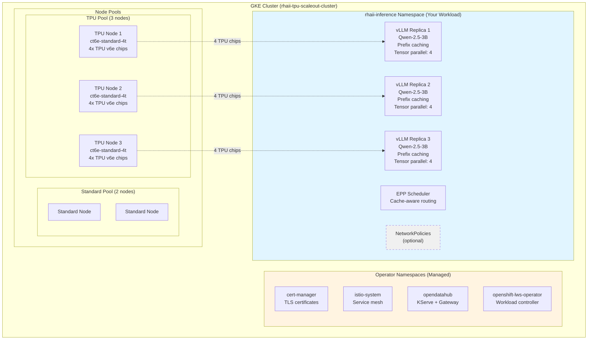
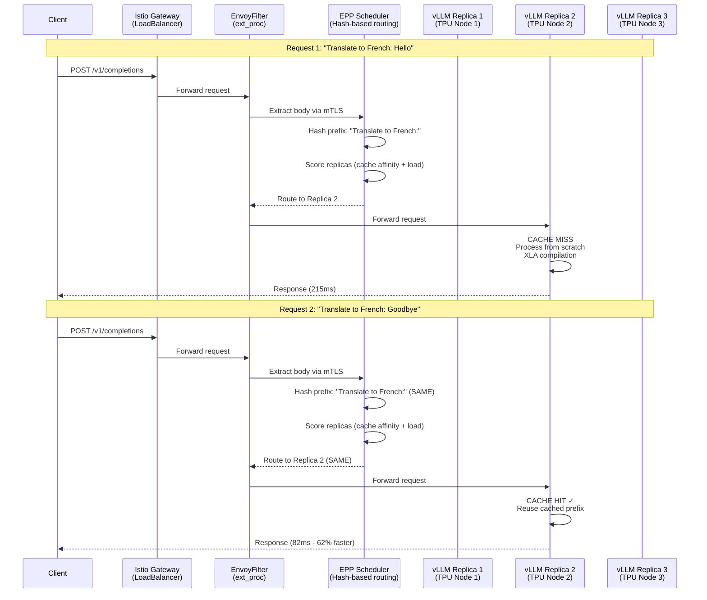

# RHAII Deployment Guide (TPU)

Deploy a vLLM inference service on TPU v6e with prefix caching and intelligent routing.

**Purpose:** Proof of concept to demonstrate KServe and prefix caching functionality.

## Overview

**What you'll deploy:**
- GKE cluster with 3-node TPU v6e pool (12 TPU chips total)
- RHAII operators (cert-manager, Istio, KServe, LWS)
- 3-replica vLLM inference service with prefix caching enabled
- Cache-aware routing via EnvoyFilter and EPP scheduler
- Security isolation via NetworkPolicies (optional)

**Performance:**
- ~25 req/s parallel requests
- ~6.3 req/s serial requests

**Time:** ~50 minutes total

**💰 Cost:** ~$46/day if left running (3 TPU nodes). Remember to scale down when not testing!

---

## Prerequisites Checklist

Before starting, ensure you have:

- [ ] Google Cloud account with billing enabled
- [ ] Project: `YOUR_PROJECT` (or your project) with Owner/Editor role
- [ ] `gcloud` CLI installed and authenticated
- [ ] `kubectl` CLI installed
- [ ] Red Hat registry credentials in `redhat-pull-secret.yaml` (create from `templates/redhat-pull.yaml.template`)
- [ ] HuggingFace token in `huggingface-token-secret.yaml` (create from `templates/huggingface-token.yaml.template`)
- [ ] **TPU v6e quota: 12 chips minimum** (3 nodes × 4 chips)

**Need help?** See [Prerequisites Guide](prerequisites.md) for detailed setup instructions.

---

## Architecture

This deployment provides high-throughput inference with intelligent request routing.

### Deployment Overview



### Request Flow with Cache-Aware Routing



**Key Points:**
- 🔵 **Blue boxes** - Your workload namespace (you manage this)
- 🟡 **Yellow boxes** - Operator namespaces (automatically managed)
- ⚪ **Dashed boxes** - Optional components (NetworkPolicies)
- EnvoyFilter enables body forwarding to EPP scheduler via mTLS
- EPP scheduler uses hash-based routing to maximize cache hits
- Requests with identical prefixes always route to the same replica

### Components

**3 vLLM Replicas:**
- Each replica runs on dedicated TPU node (4 chips per node)
- Prefix caching enabled on all replicas
- Independent model instances with shared architecture

**Cache-Aware Routing:**
- EnvoyFilter routes requests with same prefix to same replica
- Maximizes cache hit rate for improved latency
- EPP (External Processing Protocol) scheduler integration

**Security Isolation:**
- mTLS encryption for all service-to-service communication (required)
- HTTPS with KServe-issued TLS certificates for vLLM endpoints (required)
- NetworkPolicies restrict traffic between components (optional)

### Cache Benefits

**With Prefix Caching:**
- Repeated prefixes cached in KV cache
- ~75% latency reduction on cache hits
- Higher throughput for translation, summarization, Q&A workloads

**Without Prefix Caching:**
- Every token processed from scratch
- Longer latencies for repeated patterns
- Lower overall throughput

---

## Optional: Environment Setup

To avoid repeating `--project`, `--zone`, etc. in every command:

```bash
# One-time setup
cp .envrc.example .envrc
# Edit .envrc with your project ID and zone

# Option A: Install direnv (automatic loading)
# See: https://direnv.net
direnv allow .

# Option B: Manual sourcing (no dependencies)
cp env.sh.example env.sh
# Edit env.sh
source env.sh
```

After setup, you can run commands without flags:
```bash
./scripts/preflight-check.sh --tpu
# Shorthand for: ./scripts/preflight-check.sh --accelerator tpu
# Zone defaults to europe-west4-a for TPU deployments
```

**See:** [Environment Setup Guide](environment-setup.md) for complete instructions.

---

## Step 1: Run Validation Checks (3 minutes)

Validate your environment before creating resources:

```bash
# Navigate to repository
cd /path/to/rhaii-on-xks-gke

# Run preflight check with customer-friendly output (shorthand)
./scripts/preflight-check.sh --tpu --customer

# Zone defaults to europe-west4-a (primary recommended zone for TPU v6e)
# To use a different zone: ./scripts/preflight-check.sh --tpu --zone us-south1-a --customer
```

**Success criteria:**
- ✅ All tools installed (gcloud, kubectl, jq)
- ✅ GCP authentication valid
- ✅ Required permissions granted
- ✅ Secrets exist (pull-secret, huggingface-token)
- ✅ TPU v6e quota: 12 chips available

**If checks fail:** See troubleshooting output for specific fixes.

---

## Step 2: Create GKE Cluster with 3-Node TPU Pool (20 minutes)

Create a GKE cluster with 3-node TPU v6e pool:

```bash
# Interactive cluster creation (recommended)
./scripts/create-gke-cluster.sh --tpu

# Or specify options explicitly with 3 nodes
./scripts/create-gke-cluster.sh --tpu \
  --project YOUR_PROJECT \
  --zone europe-west4-a \
  --cluster-name rhaii-tpu-scaleout-cluster \
  --num-nodes 3
```

**What this does:**
1. Validates accelerator availability in zone
2. Checks node pool prerequisites and quota (12 chips)
3. Creates GKE cluster (control plane + standard nodes)
4. Creates TPU v6e node pool with **3 nodes** (ct6e-standard-4t, 4 chips each)
5. Configures kubectl access

**Success criteria:**
- ✅ Cluster status: RUNNING
- ✅ TPU node pool created with 3 nodes
- ✅ kubectl can list nodes (should see 3 TPU nodes)

**Time:** ~20 minutes (5 min control plane + 15 min 3-node TPU pool)

**Verify node count:**
```bash
kubectl get nodes -l cloud.google.com/gke-tpu-accelerator=tpu-v6e-slice
# Should show 3 nodes
```

---

## Namespace Architecture

RHAII uses dedicated namespaces to isolate components:

| Namespace | Purpose | Managed By |
|-----------|---------|------------|
| `rhaii-inference` | Your vLLM workloads, secrets, and NetworkPolicies | You (this guide) |
| `istio-system` | Istio service mesh (istiod) | RHAII operators |
| `opendatahub` | KServe controller, inference gateway, EnvoyFilter | RHAII operators |
| `cert-manager` | TLS certificate management | RHAII operators |
| `openshift-lws-operator` | LeaderWorkerSet controller | RHAII operators |

You only interact with the `rhaii-inference` namespace. Operator namespaces are managed automatically.

---

## Step 3: Create Namespace and Secrets (2 minutes)

Create the workload namespace and deploy secrets.

**Don't have the secret files yet?** Create them from the included templates:
```bash
cp templates/redhat-pull.yaml.template redhat-pull-secret.yaml
cp templates/huggingface-token.yaml.template huggingface-token-secret.yaml
# Edit each file and replace placeholders with your credentials
```
See [Prerequisites — Required Secrets](prerequisites.md#required-secrets) for details.

```bash
# Create workload namespace with Istio sidecar injection enabled
kubectl apply -f deployments/istio-kserve/caching-pattern/manifests/namespace-rhaii-inference.yaml

# Set as default namespace for kubectl
kubectl config set-context --current --namespace=rhaii-inference

# Apply Red Hat registry pull secret to workload namespace
kubectl apply -n rhaii-inference -f redhat-pull-secret.yaml

# Apply Red Hat registry pull secret to kube-system (needed for Istio CNI DaemonSet)
kubectl apply -n kube-system -f redhat-pull-secret.yaml

# Apply HuggingFace token secret
kubectl apply -n rhaii-inference -f huggingface-token-secret.yaml

# Verify namespace has Istio injection enabled and secrets created
kubectl get namespace rhaii-inference --show-labels
kubectl get secret rhaiis-pull-secret -n rhaii-inference
kubectl get secret rhaiis-pull-secret -n kube-system
kubectl get secret huggingface-token
```

**Success criteria:**
- ✅ Namespace created with `istio-injection: enabled` label
- ✅ `rhaiis-pull-secret` exists in `rhaii-inference` namespace
- ✅ `rhaiis-pull-secret` exists in `kube-system` namespace (for Istio CNI)
- ✅ `huggingface-token` secret exists in `rhaii-inference` namespace
- ✅ No errors during kubectl apply

**Note:** The `istio-injection: enabled` label automatically injects Istio sidecars into all pods deployed in this namespace, including the EPP scheduler and vLLM workloads. This enables end-to-end mTLS encryption and uniform observability. The pull secret in `kube-system` allows the Istio CNI DaemonSet to pull images from Red Hat registry.

---

## Step 4: Install Operators via [RHAII on XKS](https://github.com/opendatahub-io/rhaii-on-xks) (10 minutes)

**Follow the installation instructions in the official repository:**

🔗 **https://github.com/opendatahub-io/rhaii-on-xks**

The repository provides automated installation for:
- cert-manager (certificate management)
- Red Hat OpenShift Service Mesh (Istio)
- KServe v0.15 (inference serving)
- LeaderWorkerSet (LWS) controller

**After installation, verify from rhaii-on-xks-gke repository:**
```bash
cd /path/to/rhaii-on-xks-gke
./scripts/verify-deployment.sh --operators-only
```

**Success criteria:**
- ✅ All operator pods Running
- ✅ cert-manager webhook ready
- ✅ Istio control plane ready
- ✅ KServe controller ready

**Time:** ~10 minutes

**Troubleshooting:** See [Operator Installation Guide](operator-installation.md)

---

## Step 4.1: Configure Istio CNI (3 minutes)

**Why needed:** GKE containers don't include iptables binaries. Istio CNI bypasses this requirement by handling traffic redirection at the CNI plugin level instead of using init containers.

**Configure Istio to use CNI:**

```bash
# 1. Deploy Istio CNI plugin
kubectl apply -f deployments/istio-kserve/caching-pattern/manifests/istio-cni.yaml

# 2. Wait for CNI daemonset pods to be ready
kubectl wait --for=condition=Ready pods -l k8s-app=istio-cni-node -n kube-system --timeout=120s

# 3. Configure Istio control plane to use CNI
kubectl patch istio default -n istio-system --type=merge -p '
{
  "spec": {
    "values": {
      "pilot": {
        "cni": {
          "enabled": true
        }
      }
    }
  }
}'

# 4. Restart istiod to apply CNI configuration
kubectl rollout restart deployment/istiod -n istio-system
kubectl rollout status deployment/istiod -n istio-system --timeout=120s

# 5. Verify CNI is enabled
kubectl get configmap istio-sidecar-injector -n istio-system -o jsonpath='{.data.values}' | jq '.pilot.cni'
# Should show: { "enabled": true, "provider": "default" }
```

**What this does:**
- Deploys istio-cni-node daemonset to all nodes (handles iptables setup)
- Configures Istio sidecar injector to skip istio-init container
- Eliminates iptables dependency in application pods
- Enables CNI-based traffic redirection (more secure, no privileged init containers)

**Success criteria:**
- ✅ istio-cni-node pods Running on all nodes (in kube-system)
- ✅ Istio CR shows `pilot.cni.enabled: true`
- ✅ istiod restarted successfully
- ✅ No iptables errors in new pods

**Time:** ~3 minutes

---

## Step 5: Deploy Inference Service (10 minutes)

Deploy the 3-replica vLLM inference service with prefix caching:

```bash
# Deploy LLMInferenceService with 3 replicas and prefix caching
kubectl apply -f deployments/istio-kserve/caching-pattern/manifests/llmisvc-tpu-caching.yaml
```

### Track Deployment Progress

Each pod goes through several stages before it's ready to serve. Use these commands to track progress:

```bash
# Watch overall pod status
kubectl get pods -n rhaii-inference -w
```

**Expected pod lifecycle:**

| Status | What's happening | Duration |
|--------|-----------------|----------|
| `Pending` | Waiting for TPU node to become available | 1-5 min |
| `Init:0/1` | storage-initializer downloading model from HuggingFace | 30-60s |
| `PodInitializing` | Init container finished, main container starting | ~10s |
| `Running` (0/1) | vLLM loading weights + XLA compilation | 3-5 min |
| `Running` (1/1) | Ready — serving inference requests | ✅ |

### Monitor Each Stage

**Model download (init container):**
```bash
# Check if model download succeeded
kubectl logs <pod-name> -n rhaii-inference -c storage-initializer
# Success: "Successfully copied hf://Qwen/Qwen2.5-3B-Instruct to /mnt/models"
```

**vLLM startup and XLA compilation (main container):**
```bash
# Follow vLLM logs in real time
kubectl logs <pod-name> -n rhaii-inference -f

# Key log messages to look for (in order):
#   "Loading safetensors checkpoint shards: 100%"  → model weights loaded
#   "Loading weights took X seconds"               → weights ready
#   "GPU KV cache size: X tokens"                  → KV cache allocated
#   "Compiling the model with different input shapes" → XLA compilation started
#   "Compiled the model with different input shapes"  → XLA compilation done
```

**LLMInferenceService status:**
```bash
kubectl get llminferenceservice -n rhaii-inference -w
# Wait for READY=True
```

### Troubleshooting Stuck Pods

```bash
# Pod stuck in Pending — check for node/resource issues
kubectl describe pod <pod-name> -n rhaii-inference | tail -20

# Pod in Init:CrashLoopBackOff — check storage-initializer logs
kubectl logs <pod-name> -n rhaii-inference -c storage-initializer

# Pod Running but 0/1 Ready — vLLM still compiling, check logs
kubectl logs <pod-name> -n rhaii-inference --tail=10
```

### Success Criteria

- ✅ LLMInferenceService READY=True
- ✅ 3 inference pods Running (1/1 Ready, one per TPU node)
- ✅ Gateway has external IP

---

## Step 6: Apply Routing Configuration (2 minutes)

Apply EnvoyFilters for cache-aware routing and HTTPRoute for health endpoints:

```bash
# Apply EnvoyFilter for EPP mTLS fix (overrides KServe DestinationRule)
kubectl apply -f deployments/istio-kserve/caching-pattern/manifests/envoyfilter-epp-mtls-fix-tpu.yaml

# Apply EnvoyFilter for ext_proc cluster configuration
kubectl apply -f deployments/istio-kserve/caching-pattern/manifests/envoyfilter-ext-proc-tpu.yaml

# Apply EnvoyFilter for body forwarding (enables cache-aware routing)
kubectl apply -f deployments/istio-kserve/caching-pattern/manifests/envoyfilter-route-extproc-body.yaml

# Apply HTTPRoute for /health and /v1/models endpoints
kubectl apply -f deployments/istio-kserve/caching-pattern/manifests/httproute-health-models-tpu.yaml
```

**What these do:**
1. **envoyfilter-epp-mtls-fix-tpu.yaml** - Configures proper Istio mTLS for EPP scheduler communication
2. **envoyfilter-ext-proc-tpu.yaml** - Configures ext_proc filter to use Istio mTLS cluster for EPP
3. **envoyfilter-route-extproc-body.yaml** - Enables request body forwarding to EPP scheduler
4. **httproute-health-models-tpu.yaml** - Routes `/health` and `/v1/models` through Gateway (KServe only routes inference endpoints by default)

**How cache-aware routing works:**
- EPP scheduler receives request body from Istio Gateway via mTLS
- EPP hashes the request prefix to identify cache affinity
- Requests with same prefix route to same replica for cache hits

**Verify:**
```bash
# Check EnvoyFilters applied
kubectl get envoyfilter -n opendatahub
# Should show 3 EnvoyFilters

# Verify EPP scheduler has Istio sidecar (automatic from namespace label)
kubectl get pods -n rhaii-inference -l app.kubernetes.io/component=llminferenceservice-router-scheduler
# Should show READY 2/2 (main + istio-proxy containers)

# Verify vLLM pods have Istio sidecars (automatic from namespace label)
kubectl get pods -n rhaii-inference -l kserve.io/component=workload
# Should show READY 2/2 for each pod (main + istio-proxy containers)
```

**Success criteria:**
- ✅ 3 EnvoyFilters applied (mTLS fix + ext_proc config + body forwarding)
- ✅ EPP scheduler pod shows 2/2 containers (automatic sidecar injection)
- ✅ All vLLM pods show 2/2 containers (automatic sidecar injection)
- ✅ No errors during apply
- ✅ Cache-aware routing ready to test

**Note:** Istio sidecars are automatically injected because the `rhaii-inference` namespace has `istio-injection: enabled`. This enables end-to-end mTLS encryption between Gateway → EPP Scheduler → vLLM pods.

---

## Step 7 (Optional): Apply NetworkPolicies for Security Isolation

**⚠️ Optional - not required for PoC**

NetworkPolicies provide network-level isolation and segmentation. They are **not required** for cache-aware routing to work.

**You can skip this step** since this is a PoC/demo deployment with test data only.

**To apply:**
```bash
kubectl apply -f deployments/istio-kserve/caching-pattern/manifests/networkpolicies/
```

**4 NetworkPolicies applied:**
1. **allow-gateway-to-vllm.yaml** - Allows Istio gateway to reach vLLM pods
2. **allow-epp-scheduler.yaml** - Allows EPP scheduler to communicate with vLLM
3. **allow-istio.yaml** - Allows Istio control plane to manage sidecars
4. **allow-vllm-egress.yaml** - Allows vLLM pods to download models from HuggingFace

**Verify:**
```bash
kubectl get networkpolicies
# Should show 4 policies
```

**Success criteria (if applied):**
- ✅ 4 NetworkPolicies created
- ✅ No errors during apply
- ✅ Network isolation enabled

---

## Step 8: Verify Deployment (5 minutes)

Verify the deployment is working:

```bash
# Automated verification
./scripts/verify-deployment.sh

# Manual testing
# Get Gateway IP
export GATEWAY_IP=$(kubectl get gateway inference-gateway -n opendatahub -o jsonpath='{.status.addresses[0].value}')

# Test health endpoint through Gateway
curl http://$GATEWAY_IP/rhaii-inference/qwen-3b-tpu-svc/health

# Test models endpoint to verify service is ready
curl http://$GATEWAY_IP/rhaii-inference/qwen-3b-tpu-svc/v1/models

# Test inference endpoint
curl -X POST http://$GATEWAY_IP/rhaii-inference/qwen-3b-tpu-svc/v1/completions \
  -H "Content-Type: application/json" \
  -d '{
    "model": "/mnt/models",
    "prompt": "Explain machine learning in one sentence:",
    "max_tokens": 50
  }'
```

**Success criteria:**
- ✅ Health endpoint returns healthy status
- ✅ Models endpoint shows `/mnt/models` available
- ✅ Inference request succeeds
- ✅ Response contains "choices" field with generated text
- ✅ All 3 vLLM replicas healthy

**Check replica status:**
```bash
# Check vLLM workload pods (LLMInferenceService uses different labels)
kubectl get pods -n rhaii-inference -l kserve.io/component=workload
# Should show 3 Running pods

# Check all LLMInferenceService components (workload + router)
kubectl get pods -n rhaii-inference -l app.kubernetes.io/part-of=llminferenceservice
# Should show 4 Running pods (3 vLLM + 1 router/scheduler)
```

**Note:** Gateway external access may require additional firewall configuration. Internal service access (via ClusterIP) works immediately.

---

## Step 9: Performance Validation (5 minutes)

Validate health endpoints, cache-aware routing, and throughput:

```bash
# Run the cache routing test (auto-detects Gateway IP)
./scripts/test-cache-routing.sh

# Or with custom options
./scripts/test-cache-routing.sh --requests 20 --concurrent 10
```

The script tests three things:
1. **Health checks** — verifies `/v1/health`, `/v1/models`, and `/v1/completions` endpoints
2. **Cache routing** — sends repeated requests with identical prefix, measures latency improvement
3. **Throughput** — fires parallel requests and reports req/s and latency percentiles

**Expected behavior (TPU):**
- First request: ~200ms (cache miss, XLA compilation)
- Subsequent requests: <100ms (cache hit on same replica)
- Throughput: ~25 req/s (parallel)
- P50 latency: <200ms

---

## Step 10: Verify Model Configuration and Cache Behavior

Confirm the correct model is loaded and prefix caching is functioning.

### Confirm Model Identity and Configuration

**Query the models endpoint to see what model is actually loaded:**

```bash
# Get Gateway IP
export GATEWAY_IP=$(kubectl get gateway inference-gateway -n opendatahub -o jsonpath='{.status.addresses[0].value}')

# Query models endpoint through Gateway
curl http://$GATEWAY_IP/rhaii-inference/qwen-3b-tpu-svc/v1/models
```

**Expected response:**
```json
{
  "object": "list",
  "data": [
    {
      "id": "/mnt/models",
      "object": "model",
      "created": 1234567890,
      "owned_by": "vllm",
      "root": "/mnt/models",
      "parent": null,
      "max_model_len": 4096
    }
  ]
}
```

The `"id": "/mnt/models"` confirms vLLM is serving the model mounted from the HuggingFace storage initializer. The `max_model_len: 4096` shows the configured context window size.

**Check pod logs for model loading details:**

```bash
# Get one of the vLLM pods
POD=$(kubectl get pods -n rhaii-inference -l kserve.io/component=workload -o jsonpath='{.items[0].metadata.name}')

# View model loading logs (use -c main to specify the vLLM container)
kubectl logs $POD -n rhaii-inference -c main | grep -A 5 "Loading weights"
```

**Expected log output:**
```
INFO: Loading safetensors checkpoint shards: 100%
INFO: Loading weights took 12.3 seconds
INFO: Model Qwen/Qwen2.5-3B-Instruct
INFO: # GPU blocks: 1234, # CPU blocks: 567
INFO: TPU KV cache size: 3145728 tokens
```

**Key verification points:**
- ✅ "Loading safetensors checkpoint shards: 100%" - All model weights loaded successfully
- ✅ Model name matches `Qwen/Qwen2.5-3B-Instruct` (or your specified model)
- ✅ KV cache size allocated (indicates caching infrastructure ready)

### Prove Prefix Caching is Working

**Test cache hit behavior with identical prefixes:**

```bash
# Export Gateway IP and construct base URL
export GATEWAY_IP=$(kubectl get gateway inference-gateway -n opendatahub -o jsonpath='{.status.addresses[0].value}')
export BASE_URL="http://$GATEWAY_IP/rhaii-inference/qwen-3b-tpu-svc"

# Run 5 requests with IDENTICAL prefix
for i in {1..5}; do
  echo "Request $i:"
  curl -s -w "\nLatency: %{time_total}s\n\n" -X POST $BASE_URL/v1/completions \
    -H "Content-Type: application/json" \
    -d '{
      "model": "/mnt/models",
      "prompt": "Translate to French: Hello world",
      "max_tokens": 10
    }'
done
```

**Expected behavior (TPU):**
```
Request 1:
{...generated text...}
Latency: 0.215s   ← CACHE MISS (first request, cold prefix)

Request 2:
{...generated text...}
Latency: 0.082s   ← CACHE HIT ✓ (62% faster)

Request 3:
{...generated text...}
Latency: 0.078s   ← CACHE HIT ✓ (64% faster)

Request 4:
{...generated text...}
Latency: 0.081s   ← CACHE HIT ✓ (62% faster)

Request 5:
{...generated text...}
Latency: 0.079s   ← CACHE HIT ✓ (63% faster)
```

**Key verification points:**
- ✅ First request has higher latency (~215ms)
- ✅ Subsequent requests **MUST be 60-75% faster** (cache hits)
- ⚠️ **If requests 2+ are NOT faster, cache-aware routing is broken!**

**If cache hits are NOT faster, check:**
```bash
# Verify EnvoyFilter is applied
kubectl get envoyfilter -n opendatahub

# Check EPP scheduler is running
kubectl get pods -n rhaii-inference -l app.kubernetes.io/component=router-scheduler

# Verify vLLM has prefix caching enabled
kubectl get pod <vllm-pod> -n rhaii-inference -o yaml | grep enable-prefix-caching
```

**Test cache miss with different prefix:**

```bash
# Now try a DIFFERENT prefix
curl -s -w "\nLatency: %{time_total}s\n\n" -X POST $BASE_URL/v1/completions \
  -H "Content-Type: application/json" \
  -d '{
    "model": "/mnt/models",
    "prompt": "Summarize in one sentence: The quick brown fox",
    "max_tokens": 10
  }'
```

**Expected:** Latency returns to ~200ms (cache miss for new prefix)

This proves the cache is prefix-specific, not just a response cache.

### Automated Cache Verification

**Use the test-cache-routing.sh script:**

```bash
./scripts/test-cache-routing.sh --requests 10 --prompt "Translate to Spanish: Hello"
```

The script will:
1. Test health endpoints
2. Measure cache hit speedup (reports percentage improvement)
3. Run throughput test with concurrent requests

**Expected output:**
```
========================================
Cache Routing Test
========================================
First request latency: 0.215s
Average subsequent latency: 0.081s
Speedup: 62.3%

✓ Cache hit acceleration detected
```

**Reference documentation:** See [Verification and Testing](verification-testing.md) for complete verification procedures.

---

## 🎉 Success!

Your RHAII TPU deployment is ready to test!

### Quick Reference

**Inference Endpoint:**
```bash
curl -k -X POST https://$GATEWAY_IP/v1/completions \
  -H "Content-Type: application/json" \
  -d '{"model": "/mnt/models", "prompt": "What is 2+2?", "max_tokens": 20}'
```

**OpenAI-Compatible API:**
- POST `/v1/completions` - Text completion
- POST `/v1/chat/completions` - Chat completion
- GET `/v1/models` - List available models
- GET `/v1/health` - Health check

**Monitor Deployment:**
```bash
# Check all 3 replicas
kubectl get pods -n rhaii-inference -l kserve.io/component=workload

# View logs for specific replica
kubectl logs <pod-name> -f

# Check resource usage across nodes
kubectl top nodes
kubectl top pods -l serving.kserve.io/inferenceservice
```

---

## Operational Procedures

### Scale Up/Down Replicas

**Add more replicas (requires additional nodes):**

```yaml
# Edit manifest
spec:
  replicas: 5  # Scale to 5 replicas
```

Apply changes:
```bash
kubectl apply -f deployments/istio-kserve/caching-pattern/manifests/llmisvc-tpu-caching.yaml

# Scale node pool to match
gcloud container clusters resize rhaii-tpu-scaleout-cluster \
  --node-pool tpu-pool \
  --num-nodes 5 \
  --zone europe-west4-a
```

**Requirements:**
- 5 replicas = 20 TPU chips (5 nodes × 4 chips)

**Scale down:**
```yaml
spec:
  replicas: 2  # Scale to 2 replicas
```

```bash
kubectl apply -f deployments/istio-kserve/caching-pattern/manifests/llmisvc-tpu-caching.yaml

# Scale node pool
gcloud container clusters resize rhaii-tpu-scaleout-cluster \
  --node-pool tpu-pool \
  --num-nodes 2 \
  --zone europe-west4-a
```

### Rolling Updates

**Update vLLM version:**
```yaml
spec:
  template:
    containers:
    - image: registry.redhat.io/rhaiis/vllm-tpu-rhel9:3.3.0  # New version
```

```bash
kubectl apply -f deployments/istio-kserve/caching-pattern/manifests/llmisvc-tpu-caching.yaml
```

KServe performs rolling updates automatically, maintaining availability:
- Updates 1 replica at a time
- Waits for new replica to be Ready
- Continues to next replica
- Zero downtime during update

---

## Scale to Zero

```bash
# Scale node pool to zero
gcloud container clusters resize rhaii-tpu-scaleout-cluster \
  --node-pool tpu-pool \
  --num-nodes 0 \
  --zone europe-west4-a
```

### Scale Back Up

```bash
# Restore 3-node pool
gcloud container clusters resize rhaii-tpu-scaleout-cluster \
  --node-pool tpu-pool \
  --num-nodes 3 \
  --zone europe-west4-a

# Wait for nodes ready (~10 minutes)
kubectl get nodes -w
```

---

## Troubleshooting

### Only 1/3 or 2/3 Replicas Starting

**Symptoms:**
- LLMInferenceService shows READY=False
- Only 1 or 2 pods Running

**Causes:**
- Insufficient TPU quota (need 12 chips)
- Node pool only has 1 or 2 nodes

**Solution:**
```bash
# Check TPU quota
gcloud compute project-info describe --project=YOUR_PROJECT | grep -i tpu

# Check node count
kubectl get nodes -l cloud.google.com/gke-tpu-accelerator=tpu-v6e-slice

# If nodes < 3, scale node pool
gcloud container clusters resize rhaii-tpu-scaleout-cluster \
  --node-pool tpu-pool \
  --num-nodes 3 \
  --zone europe-west4-a

# Check events for quota errors
kubectl get events --sort-by='.lastTimestamp' | grep -i quota
```

### Cache Routing Not Working

**Symptoms:**
- All requests have similar latency (~200ms)
- No cache hit latency improvement (<100ms)

**Causes:**
- EnvoyFilter not applied
- Request prefixes not consistent
- EPP scheduler not enabled

**Solution:**
```bash
# Verify EnvoyFilter applied
kubectl get envoyfilter -n opendatahub

# If missing, apply
kubectl apply -f deployments/istio-kserve/caching-pattern/manifests/envoyfilter-route-extproc-body.yaml

# Test with identical prompts
for i in {1..5}; do
  curl -s -w "\nTime: %{time_total}s\n" -X POST http://$GATEWAY_IP/v1/completions \
    -H "Content-Type: application/json" \
    -d '{"model": "/mnt/models", "prompt": "SAME PREFIX HERE", "max_tokens": 10}'
done
# Should show decreasing latency after first request
```

### NetworkPolicy Blocking Traffic (Only if NetworkPolicies Applied)

**Note:** This only applies if you applied NetworkPolicies in Step 8.

**Symptoms:**
- Inference requests fail with connection refused
- Gateway returns 503 errors

**Causes:**
- NetworkPolicies too restrictive
- Missing NetworkPolicy for new component

**Solution:**
```bash
# Verify all 4 NetworkPolicies applied
kubectl get networkpolicies
# Should show: allow-gateway-to-vllm, allow-epp-scheduler, allow-istio, allow-vllm-egress

# If missing, reapply
kubectl apply -f deployments/istio-kserve/caching-pattern/manifests/networkpolicies/

# Check pod connectivity
kubectl exec -it <vllm-pod> -- curl -s http://localhost:8000/health
```

### High Latency Despite Caching

**Symptoms:**
- P50 latency >500ms (expected <200ms)
- Cache hit rate low

**Causes:**
- Request prefixes vary too much
- Model loaded on cold replica
- Network congestion

**Solution:**
```bash
# Check pod resource usage
kubectl top pods -l serving.kserve.io/inferenceservice

# Analyze request patterns
kubectl logs -l serving.kserve.io/inferenceservice | grep "prompt"

# For debugging, enable vLLM request logging (removes --disable-log-requests)
# Edit manifest, remove --disable-log-requests flag
```

**See [Troubleshooting Guide](troubleshooting.md) for more solutions.**

---

## Complete Teardown

When you're done with the PoC:

```bash
# Option 1: Delete entire cluster (fastest cleanup, stops all costs)
gcloud container clusters delete rhaii-tpu-scaleout-cluster \
  --zone europe-west4-a \
  --quiet

# Option 2: Scale to zero (keeps cluster for later testing)
gcloud container clusters resize rhaii-tpu-scaleout-cluster \
  --node-pool tpu-pool \
  --num-nodes 0 \
  --zone europe-west4-a
```

**Cost impact:**
- Option 1: Stops all costs immediately
- Option 2: Saves ~$46/day (TPU nodes), but keeps control plane costs (~$3/day)

---

## Reference

**Manifests:**
- `deployments/istio-kserve/caching-pattern/manifests/llmisvc-tpu-caching.yaml`
- `deployments/istio-kserve/caching-pattern/manifests/envoyfilter-route-extproc-body.yaml`
- `deployments/istio-kserve/caching-pattern/manifests/networkpolicies/`

**Performance:** ~25 req/s parallel, ~6.3 req/s serial, <200ms P50 latency

**Recommended zones:**
- `europe-west4-a` (primary - most reliable TPU availability)
- `us-south1-a`, `us-east5-a`, `us-central1-b` (alternatives)

---

**Need help?** Check [Troubleshooting](troubleshooting.md)
